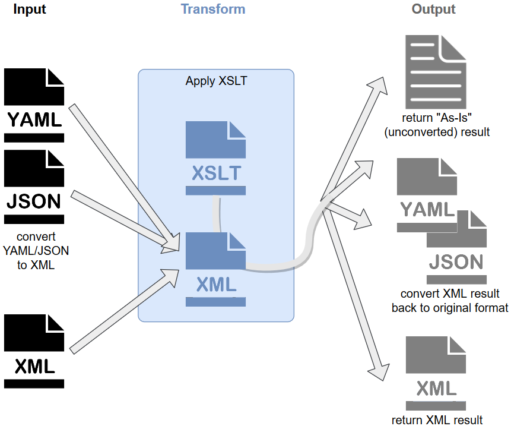

# Overview
The TransformHandler allows you to take YAML, JSON, or XML data and reformat it, or convert it from one format to another.  The TransformHandler uses XSLT to transform data sets, so all inbound data is first converted to XML for processing against the stylesheet.  You may choose to render your output as XML and allow the hander to automatically convert it back to the source format, or set `PreserveOutputAsIs = true` to retain the XSLT output without further automatic type conversion.  If  `PreserveOutputAsIs = false`, your XSLT output must be in XML in order to convert back to the source InputType.

### Basic Transformation Workflow
1. Take YAML, JSON, or XML input
2. If YAML or JSON, convert input to XML
3. Apply XSLT
   - If `PreserveOutputAsIs = true`, return string output
   - If `PreserveOutputAsIs = false`, if InputType is YAML/JSON, convert XML-output to InputType

<p align="center">

</p>


## Plan Details
### Config

The config section of the plan specifies what 

#### Sample
````yaml
  Handler:
    Type: Synapse.Handlers.DataTransformation:TransformHandler
    Config:
      Values:
        InputType: Json
        OutputType: Yaml
  Parameters:
    Values:
      Data: '{ "Valid": Data }'
      XslTransformations:
      - Xslt: <xsl:stylesheet ... >
        PreserveOutputAsIs: true
      - Xslt: <xsl:stylesheet ... >
````

|Element|Type/Value|Required|Description
|-------|----------|--------|-----------
|InputType|"[Regex](#regex)"<br>"[XmlTransform](#xmltransform)"<br>"[XPath](#xpath)"<br>"[KeyValue](#keyvalue)"<br>"[INI](#ini)"|Yes|Indicates how the file will be transformed. Details of each type of transformation can be found [here](#transformation-types)
|OutputType|Boolean|No|Creates a backup of the original file.  The backup file will have the same name as the original file with a timestamp appened. (Default = false)
