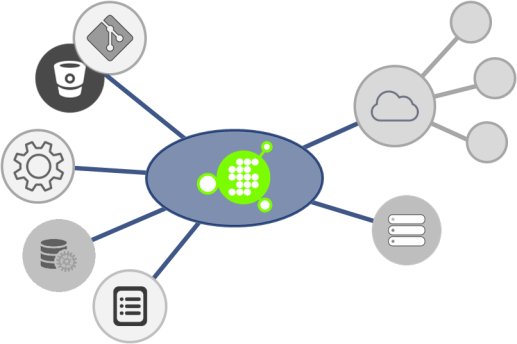

# Welcome to Synapse 🧠

Synapse is a lightweight execution engine designed to take data from disparate, federated sources and connect it to a process.  Synapse is built to run as a local or remote process.

<p align="center">

</p>

## Search this Site
[Search!](search.html)

## Elements

A Synapse workflow, called a `Plan`, is comprised of a hierarchy of Actions.  An `Action` is essentially the definition of a local or remote process and the parameters required to initiate it.  Plans are declared in YAML, as follows:

`Plan` definition:
```yaml
Name: {string, friendly name}
UniqueName: {string, globally unique name}
Description: {string, friendly description}
DefaultHandlerType: {string, used when omitting Handler.Type declaration}
IsActive: {bool, for 'disabling' Plans}
Actions:
  {Actions}
RunAs:
  {SecurityContext}
Crypto:
  KeyFile: {RSA key}
  Elements:
  - {list of Plan elements to encrypt}
StartInfo:
  RequestNumber: {string, contextual execution data}
  RequestUser: {string, contextual execution data}
```

`Action` definition:
```yaml
Action:
- Name: {string, friendly name}
  Proxy: {uri, remote Synapse node}
  ExecuteCase: {enum, status value}
  Handler:
    Type: {library}:{module}
    Config: {ParameterInfo}
  Parameters: {ParameterInfo}
  RunAs: {SecurityContext}
  ActionGroup: {Single-node subtree of child Actions}
  Actions:  {Multi-node subtree of child Actions}
  Result: {ExecuteResult}
```
Where, `ParameterInfo` is:
```yaml
Name: {string, friendly name}
Type: {enum: xml | yaml | json}
Uri: {http:// | file://}
Values:
  {Block of directly declared xml|yaml|json as specified by Type}
Dynamic:
- Name: {friendly name}
  Path: {XPath or root:path0:path1}
  Options:
  - Key: {key}
    Value: {display value}
ForEach:
- Path: {XPath or root:path0:path1}
  Values:
  - {string list}
```
And `SecurityContext` is:
```yaml
Domain: {AD Domain}
Name: {string, friendly name}
Password: {ecrypted string}
Provider: {Active Directory | AWS | Azure}
Config: {ParameterInfo}
```

Essentially, Synapse takes data from various federated sources, provides the data to an action, and executes the action under a given security context.

A overview description of Synapse Plan YAML is [here](/plans/ "Plan YAML").

## Components

| Component | Description
|--------|--------
|Synapse.Core|Contains the workflow execution engine and is responsible for initiating calls to sub-processes.
|Synapse.cli|A [command-line](/cli/core/ "Command-line") wrapper on Synapse.Core for local process execution.  Use this to test Synapse Plans locally.
|Synapse.Node|A server daemon designed to act as remote Synapse.Core agent.  Synapse.Node can execute local or remote processes.
|Synapse.Node.cli|Provides a [command-line](/cli/node/ "Command-line") interface to the Synapse.Node REST interface.  Use this to install/uninstall/start/drainstop/stop the server daemon, or to run Synapse.Node as a command-line-hosted process with console logging. 
|Synapse.Controller|An API for starting/cancelling Synapse Plan execution and recording status.  Manages execution log-capture and keeps detailed audit logs.
|Synapse.Controller.cli|Provides a [command-line](/cli/controller/ "Command-line") interface to the Synapse.Controller REST interface.  Use this to install/uninstall/start/stop the server daemon, or to run Synapse.Controller as a command-line-hosted process with console logging. 
|Synapse.Enterprise|An API for managing Synapse Plans under an RBAC.

Detailed architectural descriptions and implementations patterns can be found [here](/architecture/ "Architecture").