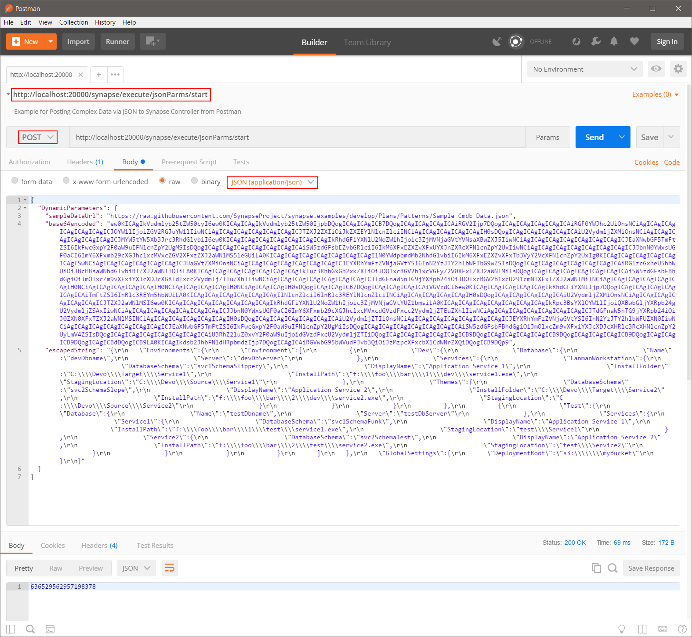
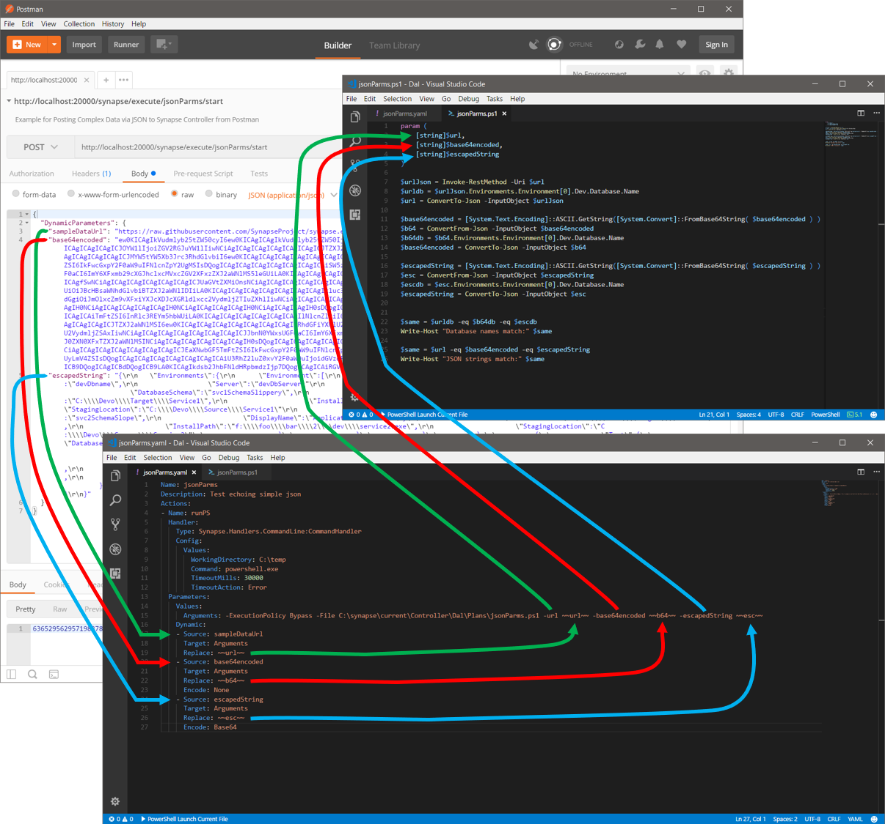

# Using Postman to create a POST request to Synapse Controller

### Abstract

This example shows how to use Postman to call a Synapse Plan that accepts a complex JSON structure via POST to the Synapse Controller.

### Get Postman

Postman offers a free or paid utility to aid in the development of APIs.  Using Postman with Synapse is not required, but you may find it helpful.  Download Postman from <a href="https://www.getpostman.com/" target="_blank">https://www.getpostman.com/</a>.

## Overview: Dynamic Paramters with POST

In general, the URI for a POST is:

- `http://host:port/synapse/execute/{planUniqueName}/start/?dryRun={true|false}&requestNumber={requestNumber}`

where sending dynamic parameters is accomplished in the http request via the `DynamicParamters` key/value pair wrapper structure.

#### POST Example

- Content-Type = application/json
- Request Body (raw):

```json
{
  "DynamicParameters": {
    "key0": "value0",
    "key1": "value1",
    "key2": "value2"
  }
}
```

## Postman Example

Consider the following Plan, Script, and Parameter set:

### Plan

This pan accepts three Dynamic parameters:

- sampleDataUrl
- base64encoded
- escapedString

Of note, the `escapedString` parameter expects a simple string value, but then converts it to a Base64 encoded string to facilitate passing the value to the script via the command line (see lines #15 and #37 in the Plan).


<script src="https://gist.github.com/SynapseGists/85f64633e70225312514722fe036a7f1.js"></script>

### Script

The script, in turn, accepts the same three parameters.  Note that naming similarity between the Dynamic parameter names in the Plan and script parameter names is for human-convenience only - Synapse doe not require variable-name matching between Plan->Parameters->Dynamic and script parameter names.

#### Script Parameters

```powershell
param (
    [string]$url,
    [string]$base64encoded,
    [string]$escapedString
)
```

#### Script

<script src="https://gist.github.com/SynapseGists/2443d306a99f4e0e3d517fa7ba065e3a.js"></script>

### Parameters

Sending simple data via key/value pairs in JSON is straighforward and requires no special treatment.  When sending complex data, such as a JSON structure, you must either string-escape the values or encode them, such as with Base64 encoding.

In the example below, the data found at the URL show on line 3 ("sampleDataUrl") has been captured and Base64 encoded ("base64encoded"), as well as string-escaped ("escapedString").  As mentioned above in the Plan description, the string-escaped data is Base64 encoded by the Plan itself before passing it to the script.

- Note: Unlike Plan->to->Script parameters, which do not need to match names, dynamic parameters are fetched from the POST body _based on the name_ as spcified in the Plan->Parameters->Dynamic->Source settings.  The names must match, but it is not a case-sensitive comparison.

<script src="https://gist.github.com/SynapseGists/96d2b2612b3339a1e4832bdf3c9e4102.js"></script>

### Postman Setup

Note the following items:

- The url reflects the Plan name, `jsonParms`.
- The HTTP request type is `POST`.
- The Content-Type is `application/json`. (This is displayed as shown on the Body tab, but is configured in Headers tab.)
- The JSON, as shown above in `Parameters`, is copied/pasted into the Body.



### Data Flow from POST to Plan to Script

- The inner-most line (green) shows the `url` variable "sampleDataUrl", to Plan->Dynamic "sampleDataUrl" (must match), to Script->parameter "url" (no need to match).
- The middle line (red) shows the `base64` variable "base64encoded", to Plan->Dynamic "base64encoded" (must match), to Script->parameter "base64encoded" (no need to match).
- The outer-most line (blue) shows the `escpaed` variable "escapedString", to Plan->Dynamic "escapedString" (must match), to Script->parameter "escapedString" (no need to match).



### Script Execution

The script itself fetches the data from the url parameter, which PowerShell automatically converts into a runtime PSObject.  The script then navigates the data structure to pull a particular value out for comparison later.  The last step of the first section converts the PSObject back to a serialized JSON string.  Following on, the script Base64-decodes the two text blobs, extracts the same value, and converts the PSObjects back to serialized JSON strings.  Lastly, the script compares the three extracted values and serialzed JSON to ensure they're all the same.
