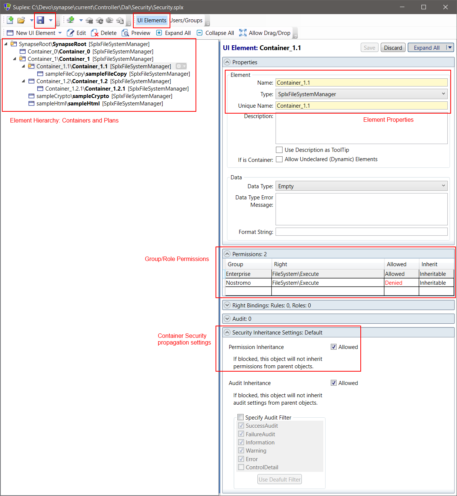
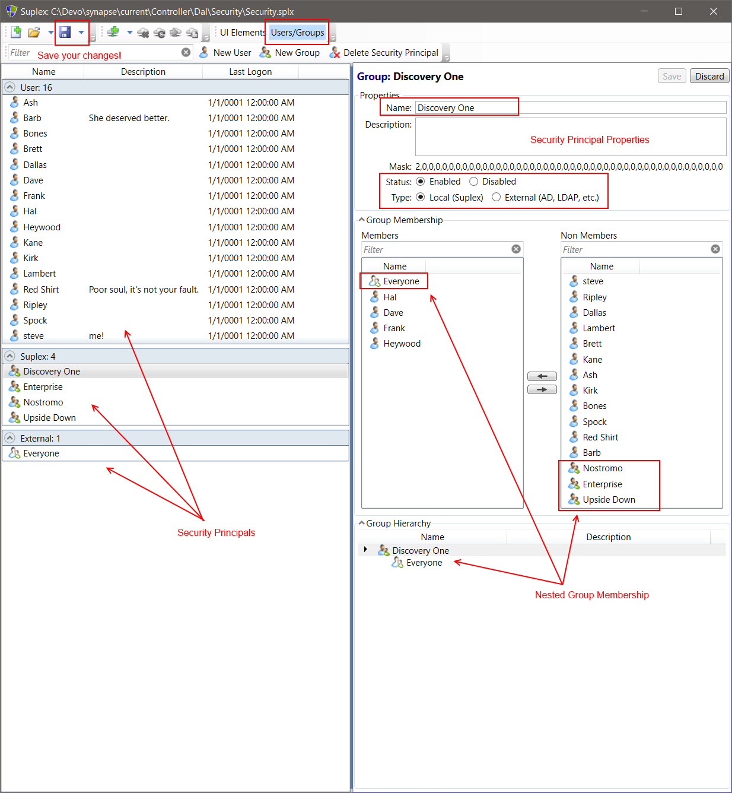

# Synapse Plan Role-Based Access Control (RBAC)

The Synapse Controller enforces the RBAC as a function of the Data Access Layer (DAL).  The editing/storage mechanism is therefore dependent on the DAL implementation in use.  Independent of the storage type, Synapse security is implemented in via an external application called Suplex.  An exhaustive description of Suplex is out of scope for Synapse documentation, but in brief, Suplex is a portable, configuration-based RBAC designed to be used by any application or API. More information can be found <a href="https://github.com/steveshortt/Suplex" target="_blank">here</a>.

## FileSystemDal

When using the FileSystemDal, the Controller will source the RBAC from Suplex file store, located in a folder path as specified by Dal.Config.Security.FilePath.

```yaml
Controller:
  ...
  Dal:
    Type: Synapse.Controller.Dal.FileSystem:FileSystemDal
    Config:
      ...
      Security:
        FilePath: Security
        IsRequired: false
        GlobalExternalGroupsCsv: Everyone
    LdapRoot:
```

|Setting|Description
|--------|--------
|FilePath|The folder where RBAC files are stored.  This path is assumed to be relative unless specified as a rooted, absolute path.
|IsRequired|Indicates whether the FileSystemDal allows execution without a Security setup.
|GlobalExternalGroupsCsv|Globally available groups specified outside the RBAC files.

### How the FileSystemDal locates Security

In addition to using the Path in `FilePath`, the FileSystemDal expects the filename `Security.splx` (not case-sensitive).  If the file is present, FileSystemDal will attempt to use it; if not Plan RBAC security is ignored, unless `IsRequired` is set to `true`.

- Effective path: `{filePath}\Security.splx`

By default, the FileSystemDal ships no default `Security.splx` file, and `IsRequired` is set to `false`.  The matrix below shows the effect of file-presence/IsRequired flag.

|Present|IsRequired|Result
|-|-|-
|Yes|False|Security Enforced
|Yes|True|Security Enforced
|No|False|Security **not** Enforced
|No|True|**Exception**; Controller will not start


## Editing Plan Security via the Suplex UI

The Synapse.Server runtime distribution locates a copy of the Suplex UI and an example security file in the .\Controller\Dal\Security folder.

- SuplexAdmin.exe: The Suplex UI.  Can be used to edit Suplex data in a file, SQL Server Database, or via a Suplex REST API.
- Security_.splx: An example security setup. (Note: the underscore character is present so that the FileSystemDal default configuration will ignore the example file.)

To Edit security, open the SuplexAdmin UI, and create/open a Security.splx file.

### Elements: Containers and Plans

- Note: not all Suplex features are implemented by Synapse; features in-use are highlighted in red boxes.
- Note: The is section of Suplex makes reference to "UI Elements" - ignore the "UI" moniker and conceive of objects as generic "elements," listed as "Containers" and "Plans."



#### SuplexAdmin UI
|Feature|Function
|-|-
|Save button|The is a file-based store; remember to save your work!<br>- Note: You do *not* need to restart the Synapse Controller to pick up edits to the file at runtime.
|UI Elements button|Switches the dialogue view to this screen.

#### Element Tree

When securing Plans, best practice is to group Plan elements within a "Container," apply Permissions to the Container, and let the permissions inherit downward.

- Note: this is logical division only; Synapse does not differentiate between "Containers" and "Plans" within the FileSyatemDal's consumption of Suplex security data as all elements are of type *SplxFileSystemManager*.  However, future implementations of the DAL may expand on this implementation.
- Note: The tops node of the tree **must** be **SynapseRoot**.

|Feature|Function
|-|-
|Element Hierarchy|The tree of Containers and Plans.  Apply Permissions to these elements.<br>- Note: The tops node of the tree **must** be **SynapseRoot**.<br>- Note: Elements with security settings applied will show a lock icon in the tree.

#### Element Properties
|Feature|Function
|-|-
|Name|Human-friendly name.
|Type|Must be **SplxFileSystemManager**.
|UniqueName|Used to look up the object at runtime.<br>- When securing a Plan, the UniqueName must **match the filename of the Plan**.<br>- When securing a "Container," UniqueName should simply be unique.

#### Group/Role Permissions
|Feature|Function
|-|-
|Permissions Grid|Add/remove groups/roles
|Group|The group/role to permit/deny.
|Right|Must be **FileSystem\Execute**.
|Allowed|Specifies if this entry allows or denies access.
|Inherit|Specifies if this entry is inherited by child elements in the element Heirarchy.

#### Container Security
|Feature|Function
|-|-
|Permmission Inheritance|Specifies if this element is eligible to inherit permissions from parent elements.

### Security: User, Groups, Roles

- Note: not all Suplex features are implemented by Synapse; features in-use are highlighted in red boxes.



#### SuplexAdmin UI
|Feature|Function
|-|-
|Save button|The is a file-based store; remember to save your work!<br>- Note: You do *not* need to restart the Synapse Controller to pick up edits to the file at runtime.
|Users/Groups button|Switches the dialogue view to this screen.

#### Security Principals

When securing Plans, best practice is to create Groups and Roles as separate entities, where a Role is container for Groups and Users.  Suplex does not formally differentiate between Roles/Groups, as that may be implemented via a group provider, such as Active Directory.  If implementing the distinction within Suplex, use "Local/Suplex Groups" for Roles and apply a meaningful naming convention.

|Feature|Function
|-|-
|Users|A User principal.  If sourcing Active Directory, the format should be `domain\username` (not case-sensitive).
|Suplex|Local groups created with Suplex.  Supports nested groups (groups that are members of other groups), where group-members can be either Suplex or "External" groups.
|External|Groups from an external provider, such as Active Directory.  If sourcing Active Directory, use the group display name.<br>- Important Note: Suplex does **not** resolve external group nesting.

#### Security Principal Properties
|Feature|Function
|-|-
|Name|Principal name. AD users **must** match `domain\username`, AD groups **must** match display name.
|Status|Enabled/Disabled.  Disabled users/groups will be denied access.
|(Group) Type|Local: A Suplex group, best used for Role implementations.  External: groups from an external identity provider, such as Active Directory.

#### Group Membership
|Feature|Function
|-|-
|Membership/Non-Membership|The left box represents Membership, the right box represents Non-Membership.  Suplex-groups are eligible for editing group membership, whereas External-groups must be edited at the source system.